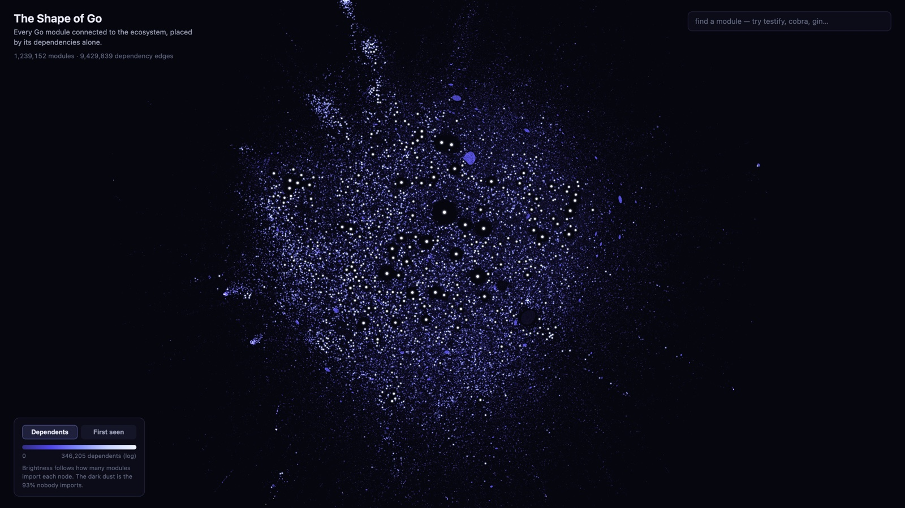
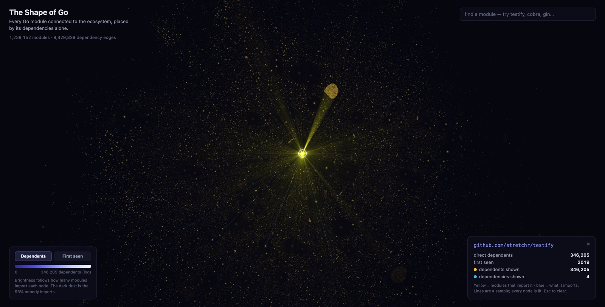

# The Shape of Go

A map of the Go module ecosystem: every public module, every declared
dependency edge, one graph. 2,638,112 modules, 9,443,537 edges, built
from the official module index and proxy and analyzed with
[gonx](https://github.com/LuisLSousa/gonx).

[](https://shape-of-go.pages.dev/)

**[Explore the galaxy live](https://shape-of-go.pages.dev/)**,
or read the write-up:
[The Shape of Go](https://luislsousa.com/blog/the-shape-of-go).

## Where the data comes from

The Go ecosystem publishes itself through two public, machine-readable
services, the same ones every `go get` already talks to:

1. **`index.golang.org/index`**: an append-only JSONL feed of every
   module version the proxy has ever seen (since April 2019), paginated
   by timestamp (`?since=...&limit=2000`).
2. **`proxy.golang.org/<module>/@v/<version>.mod`**: the raw `go.mod`
   for any module version. Its `require` directives are the dependency
   edges. `@latest` resolves the current version.

## Pipeline

```
cmd/indexsync   stream the full index -> data/index.jsonl  (resumable, checkpointed)
cmd/fetchmods   latest version per module -> fetch go.mod  (concurrent, disk-cached, resumable)
cmd/buildgraph  parse require directives -> edge list + node table
cmd/analyze     degree distributions, load-bearing modules, components
cmd/powerlaw    CCDF + Clauset-Shalizi-Newman power-law fit
cmd/layout      ForceAtlas2 + Barnes-Hut over the giant component -> 2-D galaxy positions
cmd/export      layout run -> static viewer assets (positions, attrs, labels, hub neighbors)
web/            the interactive galaxy: WebGL2 viewer, Vite + React + TS
```

Every stage is idempotent and resumable: interrupt at any point and
re-run to continue. All randomness is seeded; the graph snapshot is
dated so every number in the essay reproduces from one command per
stage.

## Syncing the index

```sh
go build -o bin/indexsync ./cmd/indexsync
nohup ./bin/indexsync >> data/sync.log 2>&1 &
```

Fully resumable: checkpointed after every page, infinite retry with
backoff on network failure (laptop sleep just stalls it), flock-guarded
against double launches. If it ever dies, re-run the same command and
it continues where it stopped. Progress: `tail -f data/sync.log`.

## The galaxy

`cmd/layout` runs deterministic ForceAtlas2 (Barnes-Hut repulsion,
adaptive speed, parallel force passes) over the 1.24M-node giant
component, and `cmd/export` packages positions plus attributes into
static binary assets:

```sh
go build -o bin/layout ./cmd/layout && ./bin/layout
go build -o bin/export ./cmd/export && ./bin/export
cd web && npm install && npm run dev
```

The viewer renders the entire component as one additive-blended WebGL
point cloud: brightness and size follow log in-degree (or first-seen
cohort year), search covers the top 20k modules, and clicking a hub
lights up every module that imports it.

[](https://shape-of-go.pages.dev/?m=github.com/stretchr/testify)

## Status

Pipeline, analysis, layout, and viewer complete; snapshot dated
2026-08-06. Every number in the essay regenerates from the commands in
this repo.

## License

MIT, see [LICENSE](LICENSE).
